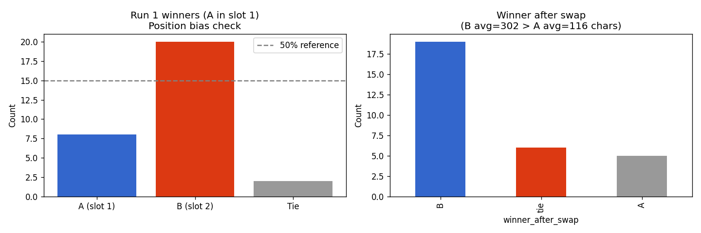

# Judge Bias Report

**Dataset:** `pairwise_results.csv` with 30 comparison pairs

## Bias 1: Position Bias

**Measurement:** percentage of cases where the answer in slot 1 (A position) wins in the first run before swapping.

| Metric | Value | Expected if unbiased |
|---|---|---|
| A wins run1 | 8/30 (26.7%) | ~50% |
| B wins run1 | 20/30 (66.7%) | ~50% |
| Ties | 2/30 (6.7%) | — |

**Verdict:** ⚠️ There is a mild position bias toward the second slot, or B-style answers, because the judge selects B more often.

**Mitigation:** swap-and-average reduces this bias. Each pair is evaluated twice with reversed order, and disagreements are collapsed into a tie.

## Bias 2: Length Bias

**Measurement:** when B's answer is longer than A's, does B win more often after the swap step?

| Metric | Value | Expected if unbiased |
|---|---|---|
| Avg length A | 116 chars | — |
| Avg length B | 302 chars | — |
| B wins when longer | 19/30 (63.3%) | ~50% |

**Verdict:** ⚠️ Length bias is noticeable: B wins 63.3% of the time when it is longer.

**Mitigation:**
- Add a clearer prompt instruction such as: “Conciseness matters; do not reward longer answers without substance.”
- Re-score the same pairs with a second judge that gives more weight to brevity.
- Run a control experiment by truncating answer_b to a similar length as answer_a.

## Bias 3: Self-Consistency

**Measurement:** rate at which run1_winner matches run2_winner after flipping the second run.

- Self-consistency rate: **83.3%**
- Inconsistent pairs (resolved to tie): **5**

**Verdict:** ✅ The judge is stable across runs.

## Conclusion and Next Steps

1. **Keep swap-and-average** because it works well against position bias.
2. **Tighten the rubric** so verbosity does not get rewarded unless it adds real value.
3. **Use a bias-aware tie threshold** when the length difference is larger than 1.5x.
4. **Recompute kappa** after the mitigation pass and aim for kappa ≥ 0.6.

