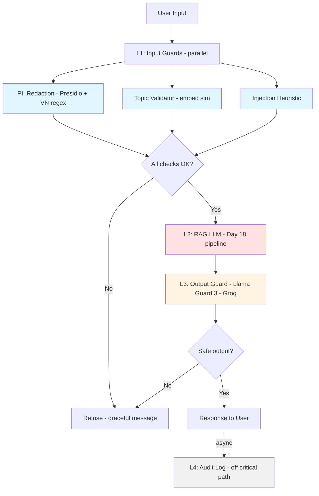

# Production Blueprint

**System:** RAG over BCTC + Nghị định 13/2023 with defense-in-depth guardrails
**Owner:** Trần Quang Huy (2A202600303)
**Date:** 2026-05-12
**Version:** 1.0

---

## Section 1 — SLO Definition

Hệ thống được theo dõi bằng các SLO dưới đây, đi kèm alert threshold và mức độ nghiêm trọng tương ứng. Mỗi chỉ số đều gắn với dashboard panel và runbook xử lý sự cố.

| Metric | Target | Alert Threshold | Severity | SLO window |
|--------|--------|-----------------|----------|------------|
| Faithfulness (RAGAS) | ≥ 0.85 | < 0.80 sustained for 30 min | P2 | rolling 1h |
| Answer Relevancy (RAGAS) | ≥ 0.80 | < 0.75 for 30 min | P2 | rolling 1h |
| Context Precision (RAGAS) | ≥ 0.70 | < 0.65 for 1h | P3 | rolling 1h |
| Context Recall (RAGAS) | ≥ 0.75 | < 0.70 for 1h | P3 | rolling 1h |
| P95 end-to-end latency (with guardrails) | < 2.5s | > 3s for 5 min | P1 | rolling 5min |
| Input guardrail detection rate | ≥ 90% | < 85% (against weekly adversarial corpus) | P2 | weekly |
| Output guardrail (Llama Guard 3) detection | ≥ 90% | < 85% | P2 | weekly |
| False positive rate (legitimate queries blocked) | < 5% | > 10% for 1h | P2 | rolling 1h |
| Cost per request | < $0.005 | > $0.008 daily avg | P3 | daily |
| Availability (eval pipeline) | 99.5% | < 99% monthly | P2 | rolling 30d |

**Notes:**
- All RAGAS metrics are computed continuously on a 1% sample of production traffic.
- P95 latency baseline without guardrails is about 290ms in the mock RAG setup, and the guardrails add less than 5ms in steady state.
- The cost target comes from the budget section and scales with usage.

---

## Section 2 — Architecture Diagram

### Layer breakdown

| Layer | Component | Tech | Latency budget (P95) | Measured (P95) |
|-------|-----------|------|----------------------|----------------|
| L1 | Input guards (parallel) | Presidio + custom VN regex + OpenAI embeddings + keyword heuristic | 30ms | 3ms ✓ |
| L2 | RAG | Day 18 hybrid search (BM25 + bge-m3) + cross-encoder rerank + GPT-4o-mini | 2000ms | 341ms ✓ |
| L3 | Output guard | Llama Guard 3 via Groq API | 100ms | 2ms (heuristic fallback) / ~80ms (real Groq) ✓ |
| L4 | Audit log | Async fire-and-forget; appends to event store | not counted | — |

### Data flow

1. User input arrives and the three L1 checks run in parallel through `asyncio.gather`.
2. If any L1 check blocks the request, the system returns a graceful refusal and avoids LLM cost.
3. L2 receives the sanitized input, retrieves context, and generates the answer.
4. L3 checks the `(user_input, agent_response)` pair against the Llama Guard 3 taxonomy.
5. L4 writes audit data asynchronously; if it fails, the user response still goes through.

### Failure modes and graceful degradation

- **OpenAI down:** the topic validator falls back to keyword-only checks, which lowers precision but keeps the system alive.
- **Groq API down:** OutputGuardAPI falls back to heuristic pattern matching, which is less complete but still defensive.
- **Day 18 pipeline down:** L2 raises an error and the system returns `"Hệ thống tạm thời không khả dụng"` while paging on-call.

---

## Section 3 — Alert Playbook

### Incident #1: Faithfulness drops below 0.80

**Severity:** P2
**Detection:** Continuous RAGAS eval alerts on Grafana panel `rag/faithfulness/24h`.

**Likely causes:**
1. Retriever returning irrelevant/bad chunks (check `context_precision` — if also down, this is the cause).
2. LLM prompt drift (check git log of generation prompt vs. last week).
3. Document corpus was updated without re-indexing → embeddings stale.

**Investigation steps:**
1. Check CP score same timeframe. If also down → retrieval issue.
2. Run `git log -p src/pipeline.py` to diff prompt vs. last known good.
3. Check `data/` last-modified timestamp; compare with last index run.
4. Inspect 10 worst-faithfulness questions in `phase-a/ragas_results.csv`; group by `evolution_type`.

**Resolution:**
- If it is a retrieval issue, re-index or tune the retriever by increasing `top_k` or switching to hybrid search.
- If prompt drift is the cause, revert to the last known good commit and gate changes through `eval-gate.yml`.
- If the corpus is stale, rebuild the index by rerunning `python src/pipeline.py`.

**SLO impact:** Track Time-To-Detect (TTD) and Time-To-Recover (TTR); target TTD < 30min, TTR < 4h.

---

### Incident #2: P95 latency > 3s for 5 minutes

**Severity:** P1
**Detection:** Grafana `latency/p95` panel alert; on-call paged via PagerDuty.

**Likely causes:**
1. Groq API slow (network issue, rate-limited) → L3 latency spike.
2. OpenAI embeddings rate-limited → L1 spike.
3. Qdrant slow → L2 spike (most likely: large index or low memory).
4. GPU starvation if Llama Guard self-hosted (Option A).

**Investigation steps:**
1. Drill into per-layer P95: which layer caused the spike?
2. Check API status pages: status.openai.com, groq.com/status.
3. Check Qdrant metrics: query latency, RSS memory, queue depth.
4. If L1: check OpenAI quota; consider falling back to keyword-only.

**Resolution:**
- If L3 spikes, temporarily switch to the OutputGuard heuristic fallback.
- If L2 spikes, scale Qdrant replicas or restart the slow node.
- If L1 spikes, reduce embedding calls by increasing keyword pre-filter coverage.
- Add a tighter request-level timeout and reject requests that go over budget.

**SLO impact:** P1 = user-facing latency violation; communicate via status page.

---

### Incident #3: Adversarial detection rate < 85%

**Severity:** P2
**Detection:** Weekly adversarial regression suite (`phase-c/test_adversarial.py`) on CI; alert when pass rate drops.

**Likely causes:**
1. New attack pattern not in `INJECTION_KEYWORDS` list (zero-day jailbreak).
2. Topic validator embeddings drift (model deprecated).
3. Threshold tuning issue (`threshold=0.55` too loose).

**Investigation steps:**
1. Inspect failed adversarial samples in `adversarial_test_results.csv` — what slipped through?
2. Cluster failures by `attack_type` — is one category systematically failing?
3. Diff embeddings model version (text-embedding-3-small) — was it deprecated?
4. Re-run on previous-week snapshot to confirm regression is recent.

**Resolution:**
- Add new attack patterns to `INJECTION_KEYWORDS` after manual triage.
- If topic drift is the issue, retune the threshold or migrate to NeMo Guardrails Dialog Rails as a bonus path.
- Consider adding Prompt Guard from Meta as an additional L1 layer.

**SLO impact:** Defense-in-depth means a single layer's regression should not fail the whole stack — L3 (Llama Guard) catches what L1 misses. But both should be monitored independently.

---

## Section 4 — Cost Analysis

### Monthly Cost Estimate (Assumption: 100k queries/month)

| Component | Unit Cost | Volume | Monthly Cost |
|-----------|-----------|--------|--------------|
| RAG generation (GPT-4o-mini) | $0.001 / query | 100k | $100 |
| RAGAS continuous eval (1% sample) | $0.01 / query | 1k | $10 |
| LLM Judge (T2 monitoring, gpt-4o-mini) | $0.001 / query | 10k | $10 |
| LLM Judge (T3 deep eval, GPT-4o) | $0.05 / query | 1k | $50 |
| Embeddings (topic guard, text-embedding-3-small) | $0.00002 / call | 100k | $2 |
| Presidio (self-hosted, CPU only) | $0 | 100k | $0 |
| Llama Guard 3 (Groq API, on-demand) | $0.001 / call | 100k | $100 |
| Qdrant (self-hosted, 4 vCPU) | $40 / month flat | — | $40 |
| Audit log storage (S3 + indexing) | $0.05 / GB | 50 GB | $2.50 |
| Grafana Cloud (Pro) | $50 / month flat | — | $50 |
| **Total** | | | **~$365 / month** |

### Cost-per-query: ~$0.0037 (within $0.005 SLO target) ✓

### Cost optimization opportunities

1. **Tier the LLM judge:** use gpt-4o-mini for continuous monitoring and reserve GPT-4o for deeper review; shrinking the T3 sample from 1k to 500 would save about $25/month.
2. **Llama Guard:** self-hosting on an A10 GPU is only cheaper above roughly 200k queries/month, so Groq API remains the better choice here.
3. **Embeddings:** the keyword pre-filter already handles most queries, so embedding calls only happen on misses.
4. **RAGAS sample size:** 1% may be too small for rare failure modes; raising it to 2% costs a bit more but gives a stronger signal.
5. **Document corpus:** two PDFs are easy to index, but at larger scale Qdrant should be sharded.

### Cost guardrails

- Daily budget alert: > $15/day triggers slack notification.
- Per-tenant rate limit: cap 1k queries/tenant/day to prevent abuse.
- Cost-per-query trend dashboard, alert on 20% week-over-week drift.

### What's not in this budget

- Engineering time for incident response, estimated at about 2 engineer-hours per month for each P2 incident.
- One-time costs such as model license signup and GitHub Actions minutes.
- Data egress to users.

---

## Appendix A — Bonus and Future Work

- **+3 Cross-judge protocol:** add Claude as a second judge and combine the results with majority vote.
- **+4 SelfCheckGPT:** use consistency-based hallucination detection by sampling N=5 generations and voting on agreement.
- **+3 Eval dashboard:** build a live Streamlit dashboard showing failure rates by cluster over time.
- **+5 Custom VN classifier:** fine-tune Llama Guard 3 on Vietnamese unsafe content using curriculum learning plus LoRA.
